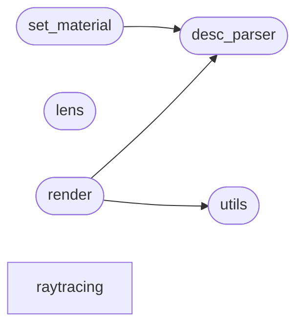

# Code Overview

[_Documentation generated by Documatic_](https://www.documatic.com)

<!---Documatic-section-Codebase Structure Python-start--->
## Codebase Structure Python

The codebase has a 2-deep folder structure,
                with 21 code files in total.

<!---Documatic-block-system_architecture-start--->

<!---Documatic-block-system_architecture-end--->

# #
<!---Documatic-section-Codebase Structure Python-end--->

<!---Documatic-section-Important Functions-start--->
## Important Functions

<!---Documatic-block-important_funcs-start--->
<!---Documatic-block-most_used_funcs-start--->
### Most Utilised Functions

* inkscape_raytracing.desc_parser.get_optics_fields (1 times)
* inkscape_raytracing.utils.pairwise (1 times)
* inkscape_raytracing.desc_parser.clear_description (1 times)
<!---Documatic-block-most_used_funcs-end--->
<!---Documatic-block-important_funcs-end--->

# #
<!---Documatic-section-Important Functions-end--->

<!---Documatic-section-Class Hierarchy-start--->
## Class Hierarchy

<!---Documatic-block-Generic[T]-start--->

	
<code>Generic[T]</code> (Click to Expand!)

* inkscape_raytracing.raytracing.geometry.geometric_object.CompoundGeometricObject

<!---Documatic-block-Generic[T]-end--->

<!---Documatic-block-Protocol-start--->

	
<code>Protocol</code> (Click to Expand!)

* inkscape_raytracing.raytracing.geometry.geometric_object.GeometricObject
* inkscape_raytracing.raytracing.material.optic_material.OpticMaterial

<!---Documatic-block-Protocol-end--->

<!---Documatic-block-RuntimeError-start--->

	
<code>RuntimeError</code> (Click to Expand!)

* inkscape_raytracing.render.LayerError

<!---Documatic-block-RuntimeError-end--->

<!---Documatic-block-inkex.Effect-start--->

	
<code>inkex.Effect</code> (Click to Expand!)

* inkscape_raytracing.set_material.SetMaterial

<!---Documatic-block-inkex.Effect-end--->

<!---Documatic-block-inkex.EffectExtension-start--->

	
<code>inkex.EffectExtension</code> (Click to Expand!)

* inkscape_raytracing.render.Raytracing

<!---Documatic-block-inkex.EffectExtension-end--->

<!---Documatic-block-inkex.GenerateExtension-start--->

	
<code>inkex.GenerateExtension</code> (Click to Expand!)

* inkscape_raytracing.lens.Lens

<!---Documatic-block-inkex.GenerateExtension-end--->

<!---Documatic-block-inkscape_raytracing.raytracing.geometry.geometric_object.GeometricObject-start--->

	
<code>inkscape_raytracing.raytracing.geometry.geometric_object.GeometricObject</code> (Click to Expand!)

* inkscape_raytracing.raytracing.geometry.cubic_bezier.CubicBezier
* inkscape_raytracing.raytracing.geometry.geometric_object.CompoundGeometricObject

<!---Documatic-block-inkscape_raytracing.raytracing.geometry.geometric_object.GeometricObject-end--->

<!---Documatic-block-inkscape_raytracing.raytracing.material.optic_material.OpticMaterial-start--->

	
<code>inkscape_raytracing.raytracing.material.optic_material.OpticMaterial</code> (Click to Expand!)

* inkscape_raytracing.raytracing.material.beamdump.BeamDump
* inkscape_raytracing.raytracing.material.beamsplitter.BeamSplitter
* inkscape_raytracing.raytracing.material.glass.Glass
* inkscape_raytracing.raytracing.material.mirror.Mirror

<!---Documatic-block-inkscape_raytracing.raytracing.material.optic_material.OpticMaterial-end--->

# #
<!---Documatic-section-Class Hierarchy-end--->

[_Documentation generated by Documatic_](https://www.documatic.com)